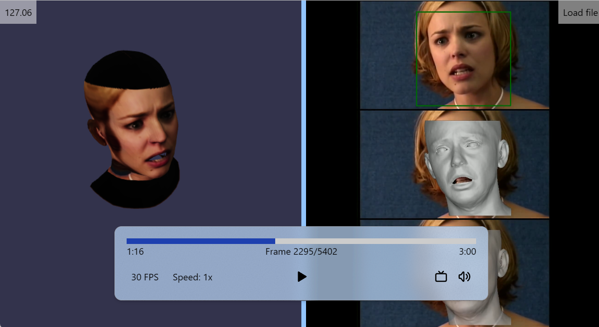

# 3D Sequencer

You have an AI model that generates 3D models (.obj, .glb,...) per each frame of a video. Given a 30 second video of 24fps, you will have 720 frames, or 720 3D files. You can feed all of that into this project to visualize the generated 3D models in a video player-like interface. The 3D model from the player is interactive, which means you can zoom in/out, rotate, and pan the model while the video is playing.

Additionally, you can include the original video/audio to play along with the 3D models. 

Made with Babylon.js + Svelte.

# Screenshot


## How to Use

Run with npm:

```bash
npm install
npm run dev
```

Build the project:

```bash
npm run build
```
